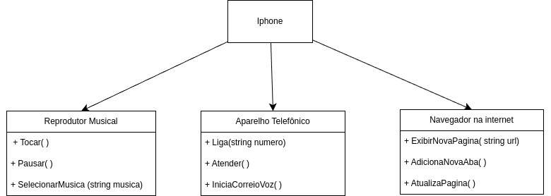

# Repositorio criado pra estudos do Bootcamp java

Repositorio Bootcamp java.

Estudo e apredizados:

- Fundamentos de java
- Fundamentos a orietação a objetos
- Testes e gerenciamento de depedencias em java
- Banco de dados SQL e NoSQL
- Produtividade com Spring framework
- Soft skills

## Projeto UML de sistema iphone

